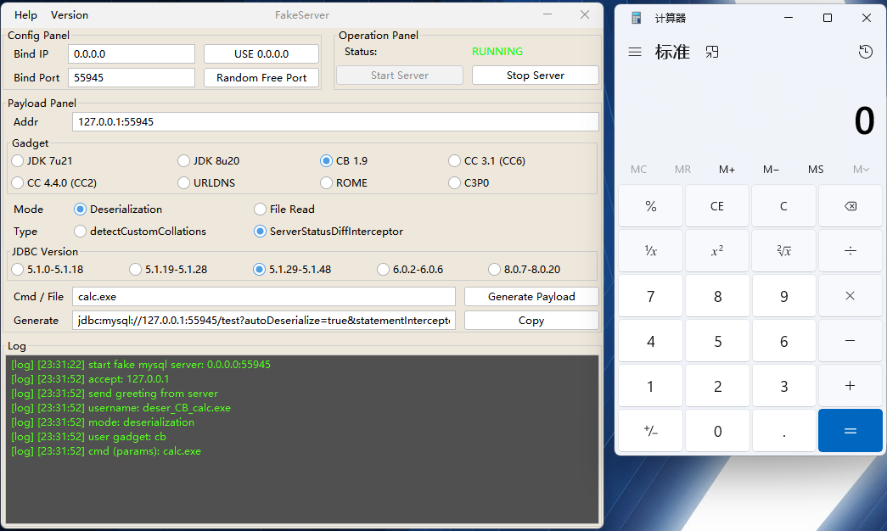
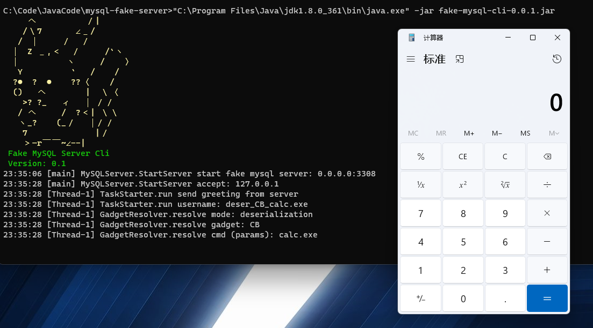
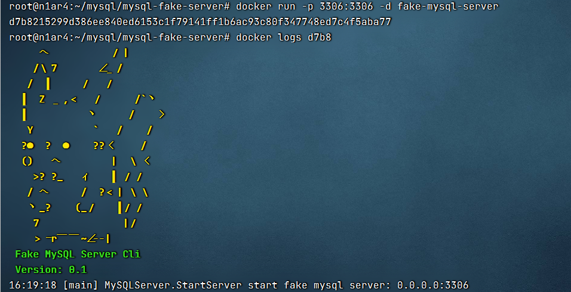

# MySQL Fake Server


[English Version](doc/README.md)

## 0x00 介绍

该项目是 [MySQL_Fake_Server](https://github.com/fnmsd/MySQL_Fake_Server) 高级版

当`JDBC URL`可控时，特殊的`MySQL`服务端可以读取`JDBC`客户端任意文件或执行反序列化操作

完全使用`Java`实现部分`MySQL`协议，内置常见`ysoserial`链，一键启动，自动生成可用的`payload`用于测试

## 0x01 GUI

使用`GUI`版本一键启动，启动后可以根据自己的环境输入参数，生成`payload`

启动：`java -jar fake-mysql-gui.jar`



## 0x02 CLI

当你的环境不允许使用`GUI`版时，可以使用命令行版启动，同样可以使用`GUI`辅助生成`payload`

启动：`java -jar fake-mysql-cli.jar -p [port]`



## 0x03 Docker

构建：`docker build -t fake-mysql-server .`

启动：`docker run -p 3306:3306 -d fake-mysql-server`



## 0x04 RPC

本项目提供了`GRPC`调用的方式

启动：`java -jar fake-mysql-rpc.jar`（默认启动端口9999）

proto:

```protobuf
syntax = "proto3";

option java_package = "me.n1ar4.fake.rpc";
option java_outer_classname = "FakeServerRPC";
option java_multiple_files = true;

package me.n1ar4.fake.rpc;

service RPCStart {
  rpc start (RPCNull) returns (RPCResp) {}
  rpc stop (RPCPort) returns(RPCResp) {}
}

message RPCNull{}

message RPCResp {
  string status = 1;
  int32 port = 2;
}

message RPCPort {
  int32 port = 1;
}
```

## 0x05 其他


## 0x06 免责申明

本项目仅面向安全研究与学习，禁止任何非法用途

如您在使用本项目的过程中存在任何非法行为，您需自行承担相应后果

除非您已充分阅读、完全理解并接受本协议，否则，请您不要使用本项目

## 0x07 致谢与参考

- https://github.com/frohoff/ysoserial
- https://github.com/fnmsd/MySQL_Fake_Server
- https://pyn3rd.github.io/2022/06/06/Make-JDBC-Attacks-Brillian-Again-I/
