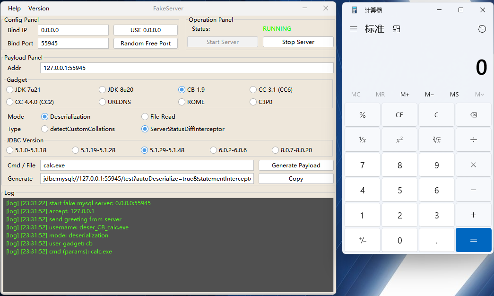

# MySQL Fake Server


## 0x00 Introduction

This project is an advanced version of [MySQL_Fake_Server](https://github.com/fnmsd/MySQL_Fake_Server).

When the `JDBC URL` is controllable, a special `MySQL` server can read any file or perform deserialization operations on the `JDBC` client.

The `MySQL` protocol is partially implemented entirely using `Java`, with built-in common `ysoserial` chains, one-click launch, and automatic generation of usable payloads for testing.

## 0x01 GUI

Use the `GUI` version to start with one click. After starting, you can enter parameters according to your environment to generate a payload.

Launch: `java -jar fake-mysql-gui.jar`



## 0x02 CLI

When your environment does not allow the use of the `GUI` version, you can use the command line version to start, and also use the `GUI` to generate a payload.

Launch: `java -jar fake-mysql-cli.jar -p [port]`


## 0x03 Docker

Build: `docker build -t fake-mysql-server .`

Launch: `docker run -p 3306:3306 -d fake-mysql-server`


## 0x04 RPC

This project provides a `GRPC` call method.

Launch: `java -jar fake-mysql-rpc.jar` (default launch port 9999)

proto:

```protobuf
syntax = "proto3";

option java_package = "me.n1ar4.fake.rpc";
option java_outer_classname = "FakeServerRPC";
option java_multiple_files = true;

package me.n1ar4.fake.rpc;

service RPCStart {
  rpc start (RPCNull) returns (RPCResp) {}
  rpc stop (RPCPort) returns(RPCResp) {}
}

message RPCNull{}

message RPCResp {
  string status = 1;
  int32 port = 2;
}

message RPCPort {
  int32 port = 1;
}
```

## 0x05 Disclaimer

This project is only for security research and learning purposes. Any illegal use is prohibited.

If you engage in any illegal behavior during the use of this project, you will be responsible for the consequences.

Unless you have fully read, completely understood, and accepted this agreement, please do not use this project.

## 0x06 Acknowledgments and References

- https://github.com/frohoff/ysoserial
- https://github.com/fnmsd/MySQL_Fake_Server
- https://pyn3rd.github.io/2022/06/06/Make-JDBC-Attacks-Brillian-Again-I/